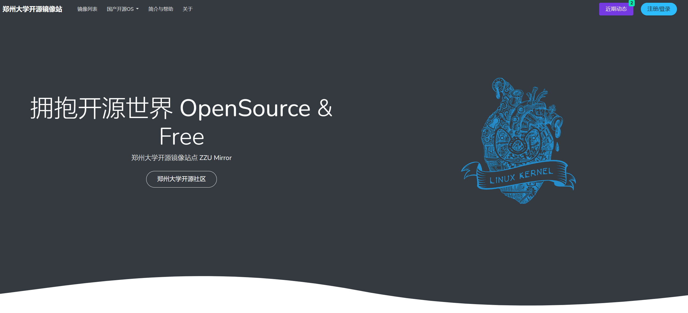
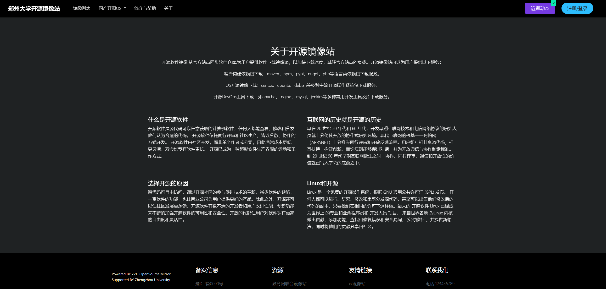
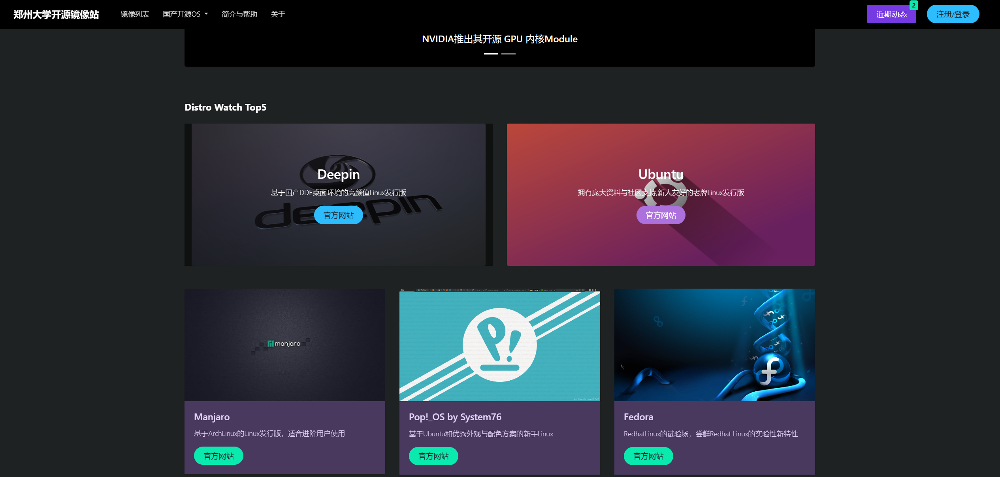
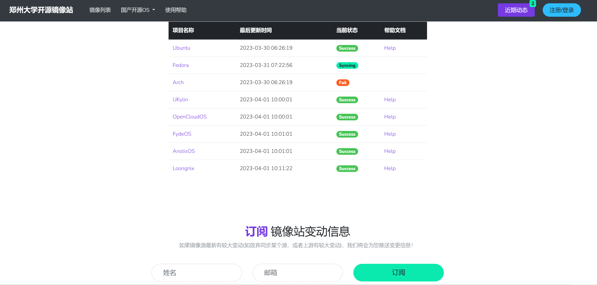
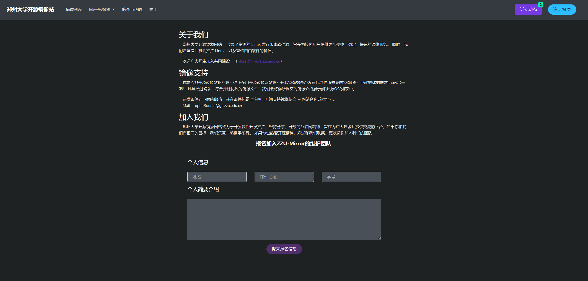
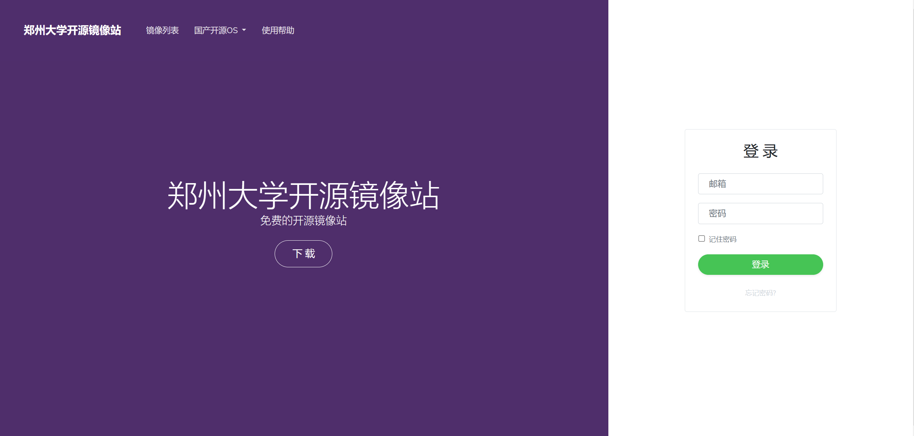

<h1 align="center">ZzuOpenSourceMirror</h1>
<br/>

## 项目说明

开源镜像站是提供了许多开源软件的源代码和发行安装包的镜像，供用户下载和使用。由于大多数开源项目的源服务器位于国外，没有国内的服务器，有时候一些国外的开源软件网站访问速度极慢或无法访问。如果有国内的镜像站，就可以利用国内的网络资源，提高下载速度和效率，就可以极大提升用户使用开源软件的使用体验。同时，如果在校内建立镜像站，可以减轻出口带宽压力，降低校园网服务的负载。同时提供镜像站服务可以对对开源社区提供支持，宣传开源精神，促进开源文化的发展。创建的面向校园网环境的镜像站，能够提供简易便捷的的使用体验，并且能够轻松接入后端数据，可以助力校园网开源镜像站的快速成型。同时，我们希望借此机会推广以及宣传自由软件的价值。欢迎广大师生加入共同建设。（https://mirrors.zzu.edu.cn）

<br/>

## 目录结构


```
ZzuOpenSourceMirror
├─assets
│  ├─css
│  │  ├─vendor
│  │  ├─main.css
│  │  └─main.css.map
│  ├─img
│  │  ├─logo
│  │  └─favicon.ico
│  ├─js
│  │  ├─vendor
│  │  └─function.js
│  └─scss
│      ├─1-frameworks
│      ├─2-plugins
│      ├─3-base
│      ├─4-modules
│      └─5-layout
└─docs
│  ├─debian.html
│  ├─fydeos.html
│  ├─kali.html
│  ├─template.html
│  └─ubuntu.html
├─docs.html
├─index.html
├─info.html
├─login.html
├─mirrors.html
└─README.html
```
<br/>

## 项目预览
<br/>
<br/>
<br/>
<br/>
<br/>
<br/>

<br/>

## 技术栈

**Bootstrap + HTML5 + CSS + JS**

<br/>

<br/>

## 贡献者

- Cerber2ol8

- Cyberloafing

- cks1999

<br/>