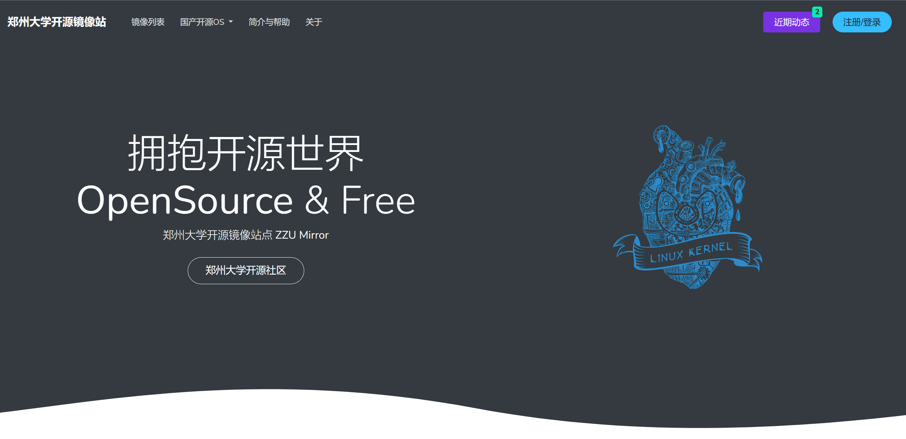

# ZzuOpenSourceMirror 
郑州大学开源镜像站是由郑州大学xxxx维护的一个开源软件镜像站点。

[样例](https://github.com/Cerber2ol8/ZzuOpenSourceMirror) &nbsp; | &nbsp; [下载](https://github.com/Cerber2ol8/ZzuOpenSourceMirror/archive/refs/heads/main.zip)

## Getting Started

[文档](https://github.com/Cerber2ol8/ZzuOpenSourceMirror/tree/main/docs).

## Built With

* [Bootstrap](https://github.com/twbs/bootstrap)
* [Gulp](https://gulpjs.com/)

## Copyright

Powered BY <a target="_blank" href="https://mirrors.zzu.edu.cn">ZZU OpenSource Mirror</a>		

Supported BY <a target="_blank" href="https://www.zzu.edu.cn">Zhengzhou University</a>

</a>

## Contribute

Let's make this even better!

- [Clone the repo](https://github.com/Cerber2ol8/ZzuOpenSourceMirror.git).
- Create a branch off of master and give it a meaningful name (e.g. my-new-feature).
- Open a pull request on GitHub and describe the feature or fix.

Thank you for your support!